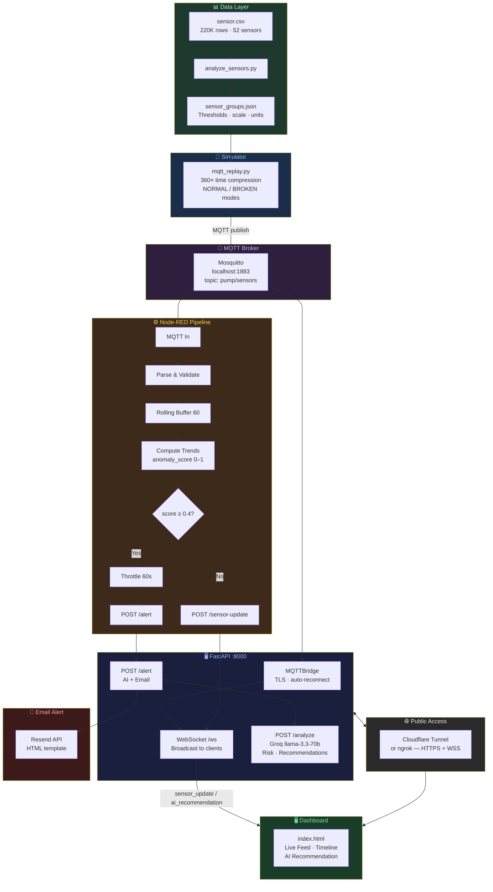
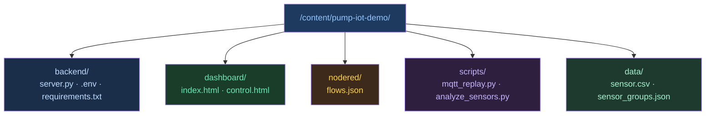
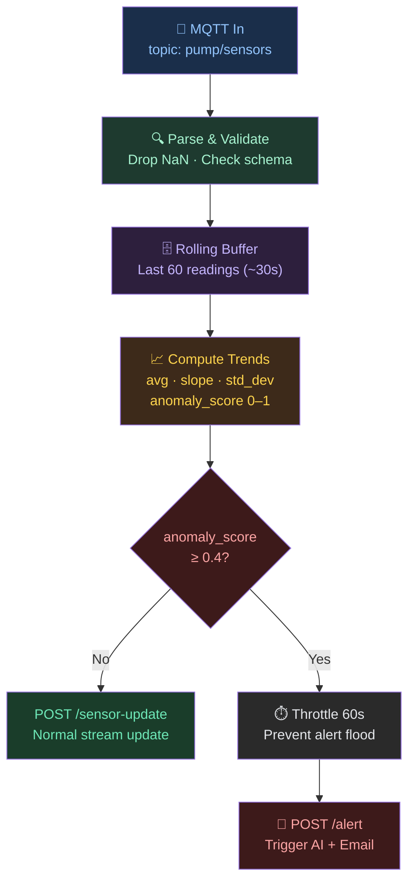
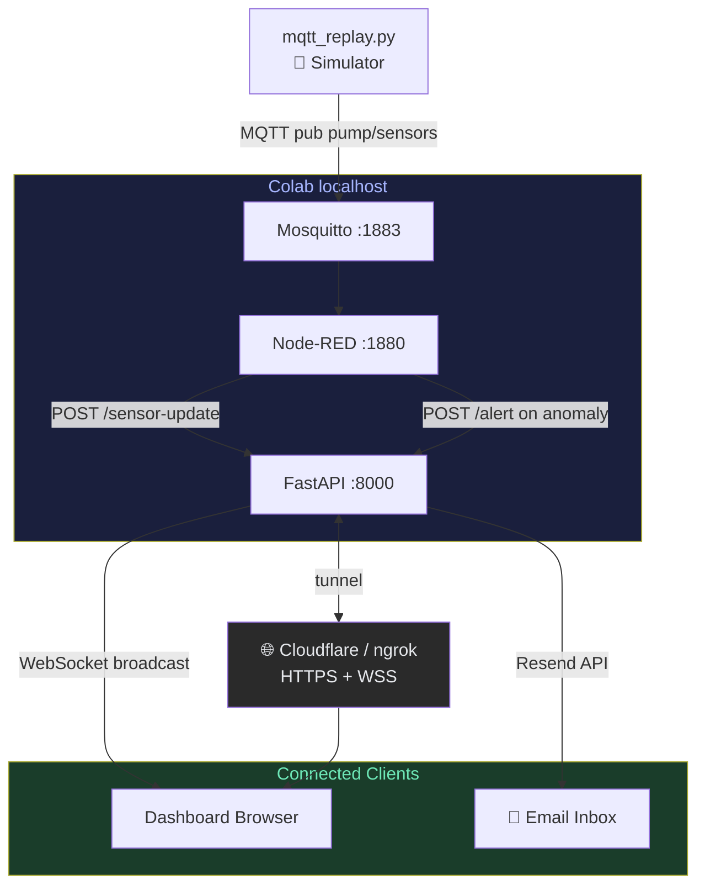
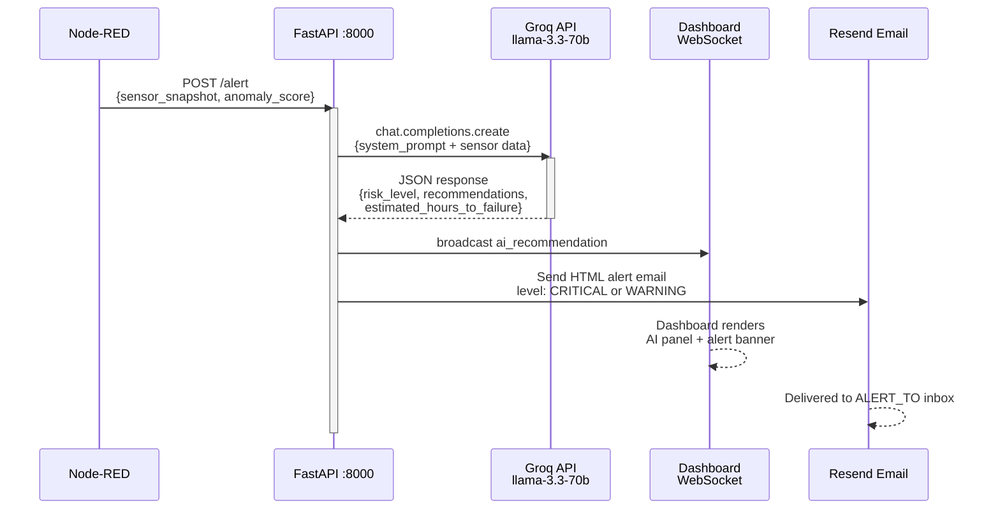

# PumpGuard AI — Architecture Diagrams

> Mermaid diagrams for all architecture/pipeline sections in the workshop.
> Paste into the corresponding notebook markdown cells.

---

## 1. System Overview (Cover / Part 0)

---

## 2. Project Directory Structure (Part 1)

---

## 3. Node-RED Sensor Processing Pipeline (Part 5)

---

## 4. Sensor Simulator Data Pipeline (Part 7)

```mermaid
flowchart LR
    CSV["sensor.csv\n220K rows"]
    ASC["analyze_sensors.py\nGroup sensors\nCompute thresholds"]
    SGJ["sensor_groups.json\nConfig: warn/crit\nscale · offset · unit"]
    REPLAY["mqtt_replay.py\n360× speed\nNORMAL / BROKEN"]
    MOSQ["Mosquitto\n:1883\npump/sensors"]
    NR["Node-RED\n:1880"]
    DASH["Dashboard\nBrowser"]

    CSV --> ASC --> SGJ --> REPLAY
    REPLAY -->|"MQTT publish\nevery 167ms"| MOSQ
    MOSQ --> NR -->|"POST /sensor-update\nor POST /alert"| DASH

    style CSV    fill:#1e3a2f,color:#a7f3d0
    style ASC    fill:#1e3a2f,color:#a7f3d0
    style SGJ    fill:#1e3a2f,color:#a7f3d0
    style REPLAY fill:#1a2e4a,color:#93c5fd
    style MOSQ   fill:#2d1f3d,color:#c4b5fd
    style NR     fill:#3d2a1a,color:#fcd34d
    style DASH   fill:#1a3d2a,color:#6ee7b7
```

---

## 5. End-to-End Pipeline Check (Part 8)

---

## 6. AI Analysis & Email Alert Flow (Part 9)

---

## Summary

| # | Diagram | Notebook Section | Mermaid Type |
|---|---------|-----------------|--------------|
| 1 | System Overview | Cover | `flowchart TB` |
| 2 | Directory Structure | Part 1 | `graph TD` |
| 3 | Node-RED Pipeline | Part 5 | `flowchart TD` |
| 4 | Simulator Pipeline | Part 7 | `flowchart LR` |
| 5 | End-to-End Check | Part 8 | `flowchart TD` |
| 6 | AI & Alert Flow | Part 9 | `sequenceDiagram` |
